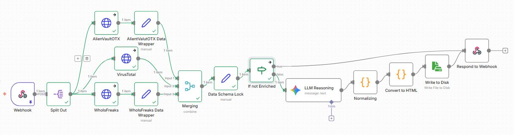

# Enrichment-Based Analysis Pipeline

This directory contains an **enrichment-based implementation** of the Agentic DNS Intelligence Pipeline, orchestrated using n8n.

In this pipeline variant, enrichment serves as the primary analytical driver, combining multiple threat-intelligence sources with LLM-based reasoning to provide contextual assessment of domain indicators.

This implementation represents one concrete realization of the overall pipeline architecture. Other analytical approaches, such as clustering-driven analysis, are developed in parallel and may be integrated as complementary or alternative pipeline derivations.

---

## Directory Structure

- `nodes/`  
  Conceptual documentation of the logical pipeline stages.

- `config/`  
  Configuration artifacts, including the n8n workflow definition.

- `code/`  
  JavaScript logic extracted verbatim from n8n Code nodes for transparency and reviewability.

- `diagram/`  
  Architectural and workflow diagrams describing the enrichment-based pipeline.

- `results/`  
  Representative output artifacts generated by pipeline executions.

---

## Design Context

The enrichment-based pipeline focuses on leveraging external intelligence sources and reasoning models to establish risk context and narrative explanations.

This design does not preclude the use of additional analytical methods. Instead, it provides a stable orchestration foundation upon which other approaches, including clustering-based techniques, can be incorporated or evaluated.

---

## Pipeline Overview

## Notes

- This pipeline emphasizes enrichment and contextual reasoning.
- Other analytical components may coexist as separate or integrated pipeline variants.
- The architecture is intentionally modular to support multiple analysis strategies.
